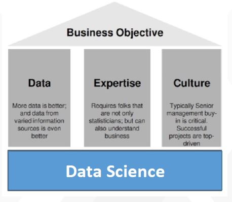
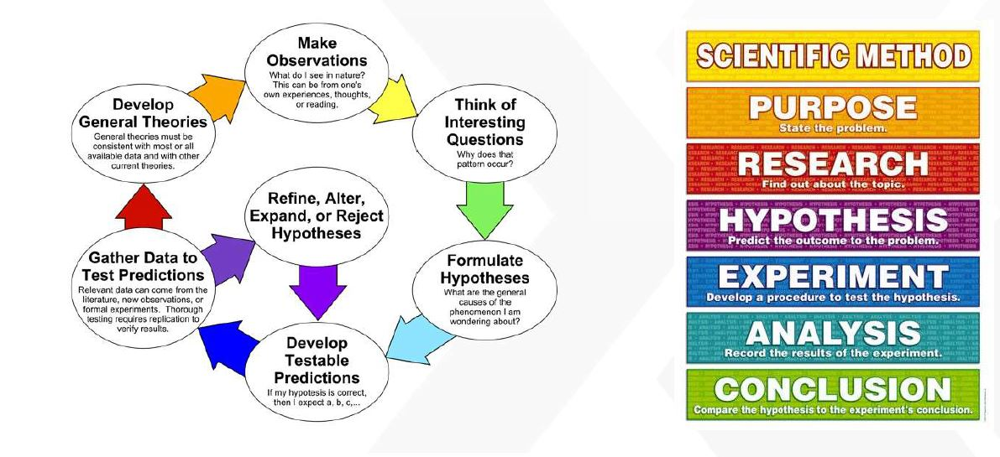
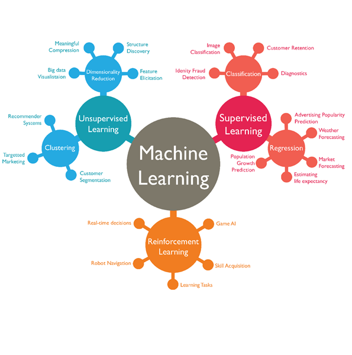

#  Introduction to DATA SCIENCE

 “To gain insights into data through
computation, statistics, and visualization.”

Data Science is Process

 Ask an interesting question                                             
                                                                                   
 Get the data

 Explore the data

 Model the data

 Communicate and visualize your results

# Tasks Involved in Lifecycle of Data Science

 Big (massive) data (millions of
users,billions of events)

 curse of dimensionality
(hundreds of variables)

 missing data (not missing at
random)

 need to avoid overfitting (test
data vs. training data)
Common Challenges

 data munging/scraping/sampling/cleaning in order to get an
informative, manageable data set;

 data storage and management in order to be able to access data
quickly and reliably during subsequent analysis;

 exploratory data analysis to generate hypotheses and intuition
about the data;

 prediction based on statistical tools such as regression,
classification,clustering, forecasting and optimization; and

 communication of results through visualization,stories,and
interpretable summaries.

# DATA SCIENCE is Multidisciplinary

# Machine Learning Branches and Types of Model : Visualization ONLY

